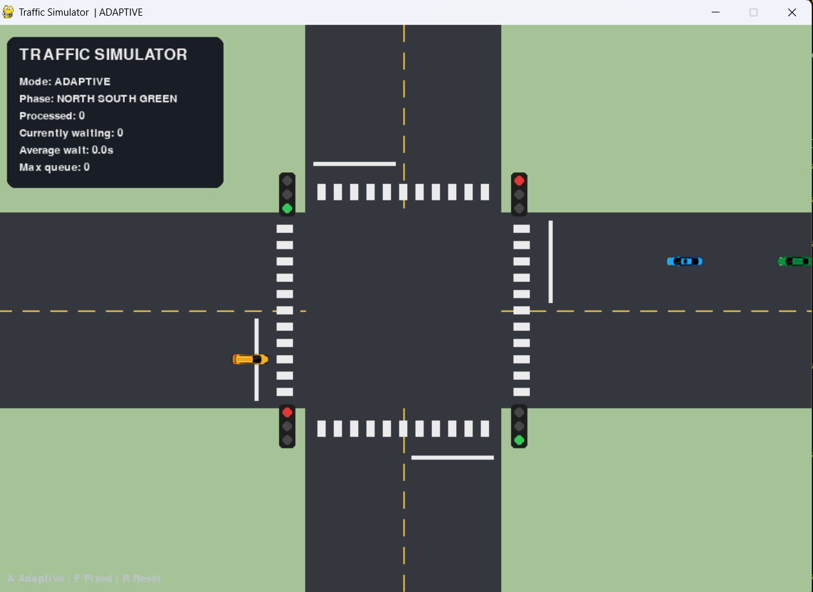

# Traffic Simulator - Fixed vs Adaptive Control

A Python and Pygame traffic intersection simulator that compares two traffic-signal strategies:

- Fixed-time signal control
- Adaptive signal control based on current traffic demand

The project simulates vehicles approaching a four-way intersection, stopping at traffic lights, maintaining safe spacing, and passing through the junction according to the selected controller.

---

## How It Works

The intersection contains four directions:

- North
- South
- East
- West

North/South operate as one signal group and East/West as another.

### Fixed Mode

Fixed mode changes the signal after a predetermined amount of time.

Example:

```text
North/South Green
        ↓
     6 seconds
        ↓
North/South Yellow
        ↓
     All Red
        ↓
East/West Green
```

## Demo

### Screenshot



### Fixed Mode

[Watch Fixed Mode Demo](demo/fixed_mode.mp4)

### Adaptive Mode

[Watch Adaptive Mode Demo](demo/adaptive_mode.mp4)